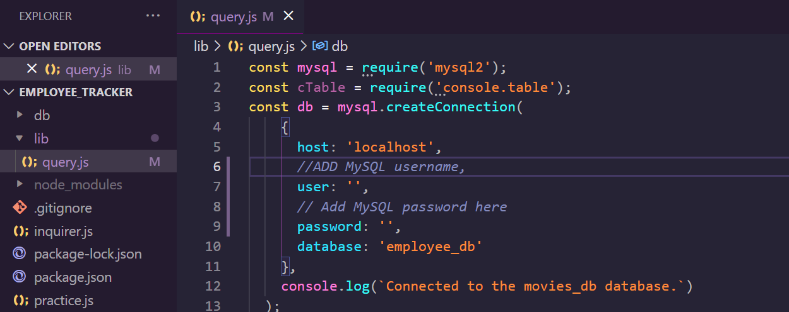
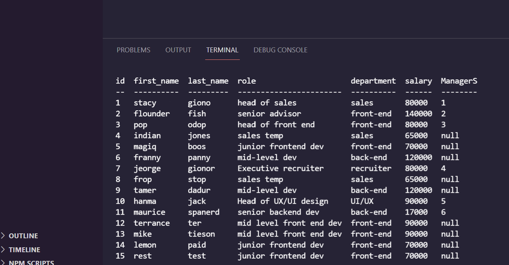

# Employee_Tracker
[](https://opensource.org/licenses/MIT)

## Table of Contents
 
* [Description](#Description "Goto Description")
* [Installation](#Installation "Goto Installation")
* [Usage](#Usage "Goto Usage")
* [Contributions](#Contributions "Goto Contributions")
* [Tests](#Tests "Goto Tests")
* [Questions](#Questions "Goto Questions")
- - - -


## Description

This project allows anyone who runs a business, works in one, or people who just want to track the activities of their staff to be able to view the data of everyone on their team. The application uses mysql2, console.table, inquirer, and node js.

## Installation

In order to install this application you are going to need to download the necessary packages, set up the database, and run inquirer command. 
To set up the data base you are going to want to go into the lib folder and go into the query.js file. At the top open the db constant, once you see the whole object fill in your credentials. Then open the terminal in the db file, log into your mysql, then run source index.sql. You should be all set afterwards.



```
npm i
```
```
source index.sql
```


## Usage

After forking, cloning, and running the nessecary commands in the terminal, a list of questions should appear. fill out the answers to fit your team. When you're done press exit and then enter to close the application.



[Application in action](https://watch.screencastify.com/v/U2yAVvpmEtoirxn1qJq1)

## Contribution Guidelines

I looked into other peoples code to try and help me figure out some of my bugs. Their profiles will be linked below:

[Jason GitHub](https://github.com/jasonluxie)

[Jessica GitHub](https://github.com/jessicamcg)


## Tests
Type this command after running the index.sql in the sql terminal and run some of the hidden functions within the query.js folder.

```
source seeds.sql
```


## Licence

This application uses [License: MIT](https://opensource.org/licenses/MIT)


## Questions

To see more of my projects visit my page below:
[My GitHub](https://github.com/BossyLemon0)

If you have any questions you can contact me through my email:
omardramirez2002@gmail.com

[Back to Top](#Note_Taker "Goto top")
